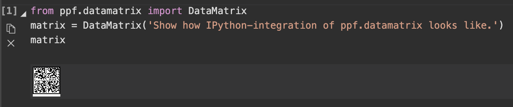

ppf.datamatrix is a pure-python package to generate datamatrix codes in SVG. Also, it integrates nicely in IPython.

ppf.datamatrix has been ported from [datalog's datamatrix-svg](https://github.com/datalog/datamatrix-svg), which is written in javascript. If you like to see what you'll get before installation, check out their [nice web demo](https://datalog.github.io/demo/datamatrix-svg).

Creating a datamatrix with ppf.datamatrix is as easy as

```
from ppf.datamatrix import DataMatrix

myDataMatrix = DataMatrix('Test!')
```

If you are working in a graphically enabled IPython terminal, you'll see your datamatrix immediately:



Using the DataMatrix object you get the SVG source like this:

```
myDataMatrix.svg()

'<?xml version="1.0" encoding="utf-8" ?><svg ...'
```


Use this on your website, to stamp a pdf, to uniquely identify a drawing, or whatever you like. Background and foreground color are configurable by specifying fg and/or bg arguments. Create a light blue matrix on a petrol background like this:

```
myDataMatrix.svg(fg='#EEF', bg='#09D')
```


Note: This sets the colors of the SVG. It does *not* change the color of the representation inside your IPython terminal.


## Advanced Features

ppf.datamatrix supports a [variety of encodings](https://en.m.wikipedia.org/wiki/Data_Matrix#Encoding), namely EDIFACT ('datamatrix.edifact'), ASCII ('datamatrix.ascii'), X12 ('datamatrix.X12'), C40 ('datamatrix.C40'), TEXT ('datamatrix.text'). These are used to store your message inside the datamatrix code efficiently. DataMatrix handles the encoding internally: If you just want to create a DataMatrix, you don't have to care about any of this. If you want to do advanced stuff (designing your own form of matrix code, maybe), ppf.datamatrix enables you to use its encoders. After importing ppf.datamatrix, they are available via the python codecs system:

```
import ppf.datamatrix

encoded = 'TEST'.encode('datamatrix.edifact')
encoded
b'\xf0PT\xd4'

decoded = encoded.decode('datamatrix.edifact')
decoded
'TEST'
```


# Installation

ppf.datamatrix is available via [pypi](https://pypi.org):

```
pip install ppf.datamatrix
```


# Change Log

* 0.1: Initial port of datamatrix–svg
